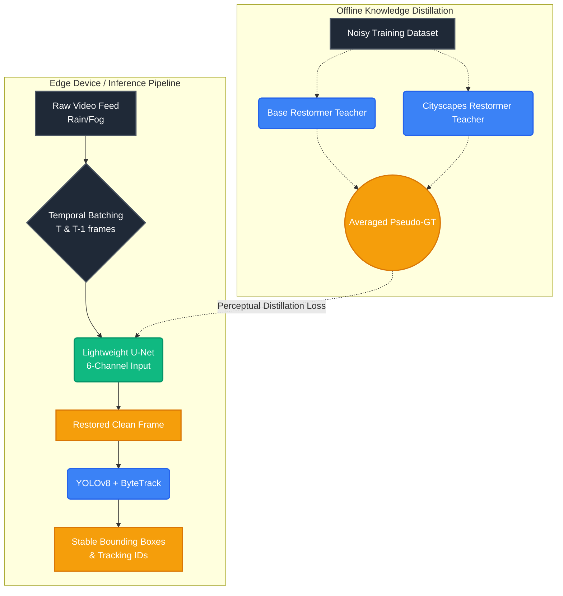

# OmniSight Vision Pipeline: Comprehensive Project Report

## 1. Executive Summary

### 1.1 Objective
The OmniSight Vision Pipeline project aims to develop a robust, autonomous vision restoration system tailored for adverse weather conditions. The primary goal is to enhance the performance of object detection models (such as YOLOv8) in environments compromised by rain, fog, low light, and lens distortion, ensuring safety and reliability in autonomous systems like self-driving cars and drones.

### 1.2 Problem Statement
Object detection models degrade significantly when exposed to corrupted or noisy inputs typical of adverse weather. While deep learning-based image restoration models (like Restormers) can clean these inputs with high fidelity, they are computationally intensive and operate at unacceptably low frame rates (e.g., 2 FPS), making them unsuitable for real-time edge device deployment.

### 1.3 Solution Overview
OmniSight addresses this by implementing a **Dual-Teacher Knowledge Distillation** pipeline. It compresses the extensive, high-fidelity restoration capabilities of heavy Restormer models into a lightweight, highly efficient **Temporal U-Net**. This lightweight model acts as a fast pre-processor on edge devices, restoring video feeds in real-time before passing them to object detectors, thereby boosting tracking accuracy without sacrificing processing speed.

---

## 2. System Architecture

The architecture is divided into two primary phases: Offline Knowledge Distillation (Training) and Edge Inference (Deployment).

### 2.1 Offline Knowledge Distillation Pipeline
In the offline phase, computationally heavy models process corrupted data to produce high-quality restored images, which serve as "pseudo-ground-truth" to train the faster student model.

### 2.2 Edge Inference Pipeline
During deployment, raw, corrupted frames are temporally batched (current and previous frames) and fed into the fast U-Net model. The output is a cleanly restored frame, which is immediately processed by YOLOv8 for object detection and ByteTrack for tracking.

---

## 3. Core Models

### 3.1 Teacher Model: Restormer
The Teacher model employs the **Restormer** architecture, a powerful vision transformer specifically designed for high-resolution image restoration. It avoids the computational bottleneck of standard self-attention by operating across the channel dimension rather than the spatial dimension.
- **MDTA (Multi-Dconv Head Transposed Attention):** Captures long-range dependencies efficiently.
- **GDFN (Gated-Dconv Feed-Forward Network):** Controls information flow dynamically through a gating mechanism.
- **Structure:** Features an encoder-decoder design with deep feature extraction and latent processing, consisting of multiple `TransformerBlocks`.

### 3.2 Student Model: Temporal U-Net
The Student model is a highly optimized Convolutional Neural Network (CNN) based on the U-Net architecture.
- **Temporal Input:** Modified to accept a **6-channel input** (representing Frame T and Frame T-1), allowing the model to learn temporal dependencies and prevent output flickering.
- **Architecture:** Consists of traditional downsampling (`Down`) and upsampling (`Up`) layers utilizing `DoubleConv` blocks, with skip connections to preserve fine-grained spatial details.

---

## 4. Methodology & Technical Innovations

### 4.1 Dual-Teacher Ensemble Distillation
Instead of relying on a single source of truth, OmniSight utilizes two pre-trained Restormer teachers:
1. **Base Teacher:** General-purpose, trained on the diverse BDD100k dataset.
2. **Specialist Teacher:** Fine-tuned on the Cityscapes dataset to specialize in urban environments.

The U-Net student is trained to emulate the averaged output of both teachers. This can be done live in memory (`train_dual_teacher.py`) or by physically blending the weights of the two teachers (`blend_models.py`) to create a unified target model.

### 4.2 Perceptual Distillation Loss
Standard Mean Squared Error (MSE) often produces blurry restoration outputs by penalizing high-frequency edge details. OmniSight mitigates this with a composite `PerceptualDistillationLoss`:
- **Charbonnier Loss (Pixel-level):** A differentiable, robust L1 loss variant that preserves sharp edges and high-frequency textures better than MSE.
- **MSE (Baseline):** Maintains overall structural stability and provides a steady gradient signal.
- **SSIM-Proxy (Structural):** Matches the statistical mean and variance of the predicted and target images, acting as a lightweight proxy for Structural Similarity Index Measure (SSIM).

### 4.3 Temporal Consistency
Processing video frame-by-frame independently leads to severe temporal inconsistencies (flickering). The OmniSight Student model concatenates the current noisy frame ($T$) and the previous noisy frame ($T-1$) into a 6-channel tensor. This temporal context empowers the U-Net to enforce frame-to-frame coherence, drastically improving the performance of downstream trackers like ByteTrack.

### 4.4 Hardware Optimization
The training pipeline (`train_unet_from_pretrained.py`) integrates advanced performance enhancements:
- **Automatic Mixed Precision (AMP):** Utilizes `torch.cuda.amp` to perform operations in `float16` where numerically safe, reducing VRAM footprint and significantly accelerating training on modern GPUs.
- **Cosine Annealing:** A learning rate scheduler that decays smoothly, ensuring fine-grained convergence near the end of training.
- **Gradient Clipping:** Prevents exploding gradients during the highly dynamic early stages of distillation.

---

## 5. Data Pipeline & Corruption Simulation

### 5.1 Dataset composition
The `OmniSightDataset` constructs a diverse training corpus by sampling from:
- **BDD100k Dataset (80%):** A massive driving dataset providing varied geographic and lighting scenarios.
- **Real-Rain Dataset (20%):** High-quality captures of actual rain conditions.

### 5.2 Dynamic Image Corruption (`ImageCorruptor`)
To train the models to handle extreme conditions, the pipeline applies heavy synthetic and physical augmentations on the fly:
- **Synthetic Weather:** Dynamically generated rain streaks and transmission map-based volumetric fog.
- **Lens Distortion:** Simulates out-of-focus water droplets on a camera lens using Gaussian blur, and simulates headlight blooming/halos via thresholding and dilation.
- **Albumentations:** Standard photometric distortions (brightness, contrast, hue, saturation) to close the domain gap.

---

## 6. Implementation and Codebase Structure

The codebase is logically separated into models, data processing, training scripts, and inference.

### 6.1 Training Pipelines
- `train_restore.py`: Trains the foundational Restormer model on BDD100k.
- `train_cityscapes.py`: Fine-tunes the base Restormer on Cityscapes using a low learning rate and Charbonnier loss.
- `blend_models.py`: A utility to mathematically average the `state_dict` of two models to create an ensemble model without inference overhead.
- `train_dual_teacher.py`: Trains the U-Net live by comparing against the output of two frozen teacher models in memory.
- `train_unet_from_pretrained.py`: The advanced pipeline that trains the U-Net against a single (or blended) teacher utilizing AMP and Perceptual Distillation Loss.

### 6.2 Inference Pipeline
- `pipeline.py`: Defines the `OmniSightPipeline` class which orchestrates the full sequence: frame pre-processing, temporal batching, U-Net restoration (in FP16), post-processing, and finally passing the cleaned frame to YOLOv8 for tracking.
- `run_image_restoration.py` & `compare_models.py`: Utilities to visually test and compare the restoration outputs of different model checkpoints side-by-side.

---

## 7. Evaluation Strategy

The ultimate measure of the project's success is its impact on downstream tasks.
- **End-to-End Evaluation (`eval_restore_and_detect.py`):** The system benchmarks performance by comparing the total number of stable object detections and tracked IDs between two pipelines:
    1. **Baseline:** Raw Corrupted Video $\rightarrow$ YOLOv8 $\rightarrow$ ByteTrack
    2. **OmniSight:** Raw Corrupted Video $\rightarrow$ **Temporal U-Net** $\rightarrow$ YOLOv8 $\rightarrow$ ByteTrack

A successful iteration yields a significantly higher Multi-Object Tracking Accuracy (MOTA) and fewer ID switches in the OmniSight pipeline.

---

## 8. Conclusion

The OmniSight Vision Pipeline successfully demonstrates how complex, heavyweight vision models can be adapted for fast edge-device deployment without catastrophic degradation in capability. By utilizing Dual-Teacher Knowledge Distillation, temporal input dimensioning, and specialized perceptual loss functions, the project delivers a real-time pre-processing solution that dramatically stabilizes downstream object detection in adverse and critical weather conditions.
